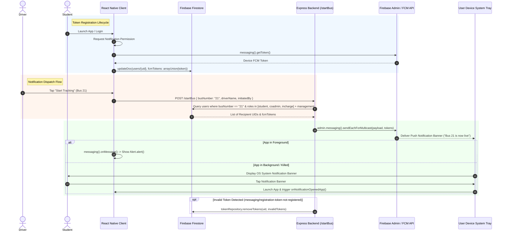

# React Native Push Notification Architecture Reference

This document provides a comprehensive end-to-end technical reference for the push notification implementation in the SIET Bus Tracking React Native app. It details every layer from device token generation to server-side FCM multicast dispatch and provides a breakdown for recreating the flow in Flutter.

---

## 1. Firebase Setup & Configuration

### Firebase Project
* **Project ID:** `iet-bus-tracking`
* **Project Number:** `320610474479`
* **Realtime DB URL:** `https://iet-bus-tracking-default-rtdb.firebaseio.com`
* **Storage Bucket:** `iet-bus-tracking.firebasestorage.app`

### Configuration Files
1. **Android Configuration:**
   * File: [`google-services.json`](file:///c:/Users/HAARHISH/Desktop/siet/sietbusapp/google-services.json) at project root (`sietbusapp/google-services.json`).
   * Package Name: `siet.com` (matches `android.package` in [`app.config.js`](file:///c:/Users/HAARHISH/Desktop/siet/sietbusapp/app.config.js#L113)).
   * Linked via Expo in [`app.config.js`](file:///c:/Users/HAARHISH/Desktop/siet/sietbusapp/app.config.js#L95): `android.googleServicesFile: './google-services.json'`.
2. **iOS Configuration:**
   * Bundle Identifier: `com.haarhish.sietbusapp` in [`app.config.js`](file:///c:/Users/HAARHISH/Desktop/siet/sietbusapp/app.config.js#L92).
   * Background Modes: `UIBackgroundModes: ['location']`.
3. **Client JavaScript Firebase Config:**
   * File: [`src/services/firebaseConfig.js`](file:///c:/Users/HAARHISH/Desktop/siet/sietbusapp/src/services/firebaseConfig.js)
   * Reads credentials from Expo environment variables via `Constants.expoConfig.extra.firebase`.

### Required NPM Packages
* `@react-native-firebase/app` (`^23.5.0`) — Core React Native Firebase native module wrapper.
* `@react-native-firebase/messaging` (`^23.5.0`) — Native FCM messaging interface for iOS/Android.
* `firebase` (`^12.3.0`) — Modular Web SDK used for client-side Firestore operations.

### Android Manifest & Native Settings
Configured via Expo config plugins in [`app.config.js`](file:///c:/Users/HAARHISH/Desktop/siet/sietbusapp/app.config.js):
* **Permissions:** `POST_NOTIFICATIONS`, `ACCESS_FINE_LOCATION`, `ACCESS_BACKGROUND_LOCATION`, `FOREGROUND_SERVICE`.
* **FCM Color Metadata:** Custom plugin `withSingleFcmColorMeta` injects `com.google.firebase.messaging.default_notification_color` (`#1D4ED8`).

---

## 2. FCM Token Flow (Device Token Lifecycle)

```
[ App Launch / Login ]
         │
         ▼
[ Check Notification Permission ]
 ├── Android: PermissionsAndroid.request('android.permission.POST_NOTIFICATIONS')
 └── Cross-Platform: messaging().requestPermission()
         │
         ▼ (Permission Granted)
[ Obtain Token: messaging().getToken() ]
         │
         ▼
[ Save to Firestore: users/{uid} ]
 ├── fcmTokens: arrayUnion(token)
 ├── lastFcmToken: token
 ├── busNumber: normalizedBusNumber (e.g. '21')
 └── role: user.role
         │
         ▼
[ Active Listeners ]
 ├── messaging().onTokenRefresh(...) ──► Re-sync newToken to Firestore
 └── AppState active event ────────────► Re-check & re-sync token
```

### Key Service Methods
* [`registerPushTokenAsync(user)`](file:///c:/Users/HAARHISH/Desktop/siet/sietbusapp/src/services/pushNotificationService.js#L111):
  1. Requests Android `POST_NOTIFICATIONS` permission and FCM messaging permissions.
  2. Enables FCM auto-init: `messaging().setAutoInitEnabled(true)`.
  3. Fetches device token via `messaging().getToken()`.
  4. Stores token into Firestore `users/{uid}` using `arrayUnion(token)` to support multiple devices per user.
  5. Attaches `onTokenRefresh` listener.
* [`useFcmTokenManager(enabled)`](file:///c:/Users/HAARHISH/Desktop/siet/sietbusapp/src/hooks/useFcmTokenManager.js#L6): React hook running token synchronization on app mount and whenever the app transitions back to the foreground state (`AppState === 'active'`).

---

## 3. Backend Integration & Data Model

### Node.js Express Relay Server
* **Server Root:** [`sietbusapp/server/`](file:///c:/Users/HAARHISH/Desktop/siet/sietbusapp/server)
* **Entry Point:** [`server/src/index.js`](file:///c:/Users/HAARHISH/Desktop/siet/sietbusapp/server/src/index.js)
* **Default Port:** `4000`
* **Client Dispatch Client:** [`src/services/backendClient.js`](file:///c:/Users/HAARHISH/Desktop/siet/sietbusapp/src/services/backendClient.js) (automatically resolves base URL from `EXPO_PUBLIC_NOTIFICATION_SERVER_URL`, Expo host IP, or `10.0.2.2:4000` / `127.0.0.1:4000`).

### Endpoints
1. **`POST /startBus`** ([`server/src/routes/busRoutes.js`](file:///c:/Users/HAARHISH/Desktop/siet/sietbusapp/server/src/routes/busRoutes.js#L6))
   * **Request Body:**
     ```json
     {
       "busNumber": "21",
       "driverName": "John Doe",
       "initiatedBy": "driver_uid_123",
       "excludeToken": "optional_token_to_skip"
     }
     ```
   * **Behavior:** Resolves all student/coadmin/incharge recipients registered to `busNumber` plus all `management` users, filters out the initiator's tokens, and dispatches a multicast FCM push notification.
2. **`POST /notify`** ([`server/src/routes/busRoutes.js`](file:///c:/Users/HAARHISH/Desktop/siet/sietbusapp/server/src/routes/busRoutes.js#L26))
   * **Request Body:**
     ```json
     {
       "recipientUid": "student_uid_456",
       "title": "Bus Delay Alert",
       "body": "Bus 21 is delayed by 10 minutes.",
       "data": { "busNumber": "21" }
     }
     ```
   * **Behavior:** Fetches tokens for `recipientUid` from Firestore and sends direct FCM push notifications.
3. **`POST /send-notification`** ([`server/src/index.js`](file:///c:/Users/HAARHISH/Desktop/siet/sietbusapp/server/src/index.js#L21))
   * Direct single-token FCM test endpoint.

### Database Schema (Firestore `users` Collection)
Document path: `users/{uid}`
```typescript
interface UserDocument {
  role: 'student' | 'driver' | 'coadmin' | 'incharge' | 'management';
  busNumber: string | null;  // e.g. "21" (normalized)
  fcmTokens: string[];       // Array of FCM registration tokens
  lastFcmToken: string;      // Most recent FCM token
  updatedAt: string;         // ISO Timestamp
}
```

---

## 4. Server-Side Firebase Admin Setup

* **Package:** `firebase-admin` (`^12.7.0`)
* **Initialization File:** [`server/src/config/firebaseAdmin.js`](file:///c:/Users/HAARHISH/Desktop/siet/sietbusapp/server/src/config/firebaseAdmin.js)

### Credentials Resolution Order
1. Environment Variable `FIREBASE_ADMIN_KEY`: Inline JSON string of the service account.
2. Environment Variable `FIREBASE_SERVICE_ACCOUNT_PATH`: Absolute/relative file path to key.
3. File System Fallback: [`server/serviceAccountKey.json`](file:///c:/Users/HAARHISH/Desktop/siet/sietbusapp/server/serviceAccountKey.json) or project root `serviceAccountKey.json`.

```javascript
admin.initializeApp({
  credential: admin.credential.cert(serviceAccountJson),
  projectId: serviceAccountJson.project_id,
});
```

---

## 5. Push Notification Trigger Events

### Primary Trigger (Bus Tracking Start)
1. Driver opens [`DriverDashboard.js`](file:///c:/Users/HAARHISH/Desktop/siet/sietbusapp/src/screens/DriverDashboard.js#L387) and clicks **"Start Tracking"**.
2. Frontend triggers [`notifyBusTrackingStarted()`](file:///c:/Users/HAARHISH/Desktop/siet/sietbusapp/src/services/pushNotificationService.js#L242):
   ```javascript
   await notifyBusTrackingStarted({
     busNumber: '21',
     driverName: 'Driver Name',
     excludeUid: driverUid,
   });
   ```
3. Request is sent via HTTP POST to `https://siet-bus-tracking.onrender.com/startBus`.

---

## 6. Server Notification Construction & Dispatching

### FCM Message Payload Structure
Built in [`server/src/services/notificationService.js`](file:///c:/Users/HAARHISH/Desktop/siet/sietbusapp/server/src/services/notificationService.js#L9):
```json
{
  "notification": {
    "title": "Bus 21 is now live",
    "body": "Driver Name started tracking. Check the live map for updates."
  },
  "data": {
    "type": "BUS_START",
    "busNumber": "21"
  },
  "android": {
    "priority": "high",
    "notification": {
      "channelId": "tracking-alerts",
      "sound": "default",
      "color": "#1D4ED8"
    }
  },
  "apns": {
    "headers": { "apns-priority": "10" },
    "payload": {
      "aps": {
        "category": "tracking-alerts",
        "sound": "default"
      }
    }
  }
}
```

### Multicast Dispatch & Stale Token Pruning
Notifications are sent using FCM multicast: `admin.messaging().sendEachForMulticast({ ...payload, tokens })`.

If FCM returns error `messaging/registration-token-not-registered` for any token, the server automatically executes [`pruneInvalidTokens()`](file:///c:/Users/HAARHISH/Desktop/siet/sietbusapp/server/src/services/notificationService.js#L74) to clean up expired/uninstalled device tokens from Firestore using `admin.firestore.FieldValue.arrayRemove(...)`.

---

## 7. React Native Client Notification Handling

1. **Foreground State:**
   * Registered in [`App.js`](file:///c:/Users/HAARHISH/Desktop/siet/sietbusapp/App.js#L53) via `subscribeToForegroundNotifications()` (`messaging().onMessage(...)`).
   * Displays an alert modal: `Alert.alert(title, body)`.
2. **Background State:**
   * Registered at application entry in [`index.js`](file:///c:/Users/HAARHISH/Desktop/siet/sietbusapp/index.js#L6) via `messaging().setBackgroundMessageHandler(...)`.
   * Standard system tray notification rendered by native FCM service.
3. **Killed-App State:**
   * Native OS renders system banner.
   * On app boot, [`App.js`](file:///c:/Users/HAARHISH/Desktop/siet/sietbusapp/App.js#L65) calls `getInitialNotification()` (`messaging().getInitialNotification()`) to inspect payload data if the app was launched by tapping the notification banner.
4. **Notification Tap:**
   * Handled by [`subscribeToNotificationOpens()`](file:///c:/Users/HAARHISH/Desktop/siet/sietbusapp/src/services/pushNotificationService.js#L281) (`messaging().onNotificationOpenedApp(...)`).

---

## 8. Authentication & Token Relationship

### Login Flow
1. User logs in via [`authService.login(...)`](file:///c:/Users/HAARHISH/Desktop/siet/sietbusapp/src/services/authService.js#L214).
2. Upon authentication success, `registerPushTokenAsync(sessionUser)` is called.
3. Obtains FCM token and links token to Firestore `users/{uid}`.

### Logout Flow
1. User clicks Logout in [`authService.logout()`](file:///c:/Users/HAARHISH/Desktop/siet/sietbusapp/src/services/authService.js#L305).
2. Calls [`removePushTokenForUser(currentUser)`](file:///c:/Users/HAARHISH/Desktop/siet/sietbusapp/src/services/pushNotificationService.js#L169).
3. Executes `arrayRemove(token)` and sets `lastFcmToken: null` in Firestore.
4. Revokes token locally on device via `messaging().deleteToken()`.

---

## 9. Full Dependency, Variable, & Endpoint Summary

### Environment Variables
| Variable Name | Location | Description |
| :--- | :--- | :--- |
| `EXPO_PUBLIC_FIREBASE_API_KEY` | `.env` | Client Firebase API key |
| `EXPO_PUBLIC_FIREBASE_PROJECT_ID` | `.env` | `iet-bus-tracking` |
| `EXPO_PUBLIC_FIREBASE_MESSAGING_SENDER_ID` | `.env` | `320610474479` |
| `EXPO_PUBLIC_NOTIFICATION_SERVER_URL` | `.env` | Backend URL (`https://siet-bus-tracking.onrender.com`) |
| `FIREBASE_ADMIN_KEY` | Server Environment | Service Account Key JSON string |
| `FIREBASE_SERVICE_ACCOUNT_PATH` | Server Environment | Path to `serviceAccountKey.json` |

### Express API Routes
* `POST /startBus` — Multicast tracking notification for a bus.
* `POST /notify` — Direct notification for single user UID.
* `POST /send-notification` — Raw FCM token test notification.

---

## 10. React Native vs. Flutter Reuse Matrix

| Feature / Artifact | React Native Specific | Reusable for Flutter Implementation |
| :--- | :---: | :---: |
| **Backend Express Server (`server/`)** | ❌ No | ✅ **100% Reusable as-is** |
| **Firebase Admin SDK & Service Account** | ❌ No | ✅ **100% Reusable as-is** |
| **Firestore `users` schema (`fcmTokens`)** | ❌ No | ✅ **100% Reusable as-is** |
| **FCM Payload (`BUS_START`, `tracking-alerts`)** | ❌ No | ✅ **100% Reusable as-is** |
| **Automatic Token Pruning Logic** | ❌ No | ✅ **100% Reusable as-is** |
| `@react-native-firebase/messaging` | ✅ Replace with `firebase_messaging` | ❌ RN Native Module |
| `app.config.js` Expo Plugins | ✅ Replace with `AndroidManifest.xml` & `Info.plist` | ❌ Expo specific |
| `PermissionsAndroid` / JS Handlers | ✅ Replace with `firebase_messaging` handlers | ❌ RN JS specific |

---

## 11. End-to-End Architecture & Sequence Diagram


